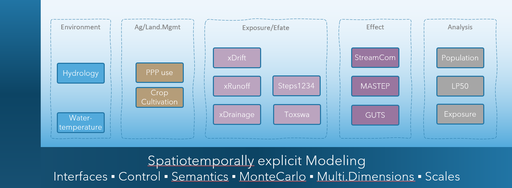

# xAquaticRisk — Model Overview

Welcome to the xAquaticRisk (xAR) documentation. This documentation provides an **introduction** and will walk new users through **how to get started** with the xAquaticRisk landscape model, including explanations for **sample scenarios** and their use for assessing aquatic risks of pesticides.

## Background

Today, **scientific models** make a great contribution to understanding and predicting the consequences of how we cultivate the landscapes we are living in. Based on present knowledge and together with data, models have become a key instrument in decision making.  
An important field is the **risk assessment and management of pesticides**. In Europe (and countries beyond), this includes an assessment of aquatic risk, in particular, for aquatic invertebrate populations in streams and water bodies ([EFSA Aquatic Guidance](https://www.efsa.europa.eu/en/efsajournal/pub/3290)).  
Beyond the use of xAR in a risk assessment and management context and given its modular and flexible design, xAR can be employed in a range of **related research and applied topics**, eg,  

- **landscape design and management, biodiversity enhancements**
- **Holistic view to risk**, multiple stressors analysis, systems-based approach  
- Risk Assessment **Recovery Option**  
- **Environmental Impact Reduction** (EIR), eg, *what if* analysis  
- **Aquatic ecosystem analysis**: effects on macroinvertebrate communities  
- **Monitoring** (design, insights, transfer of results to other regions and times)  
- Solutions for **Integrated Pest Management**  
- **Specific Protection Goals**: identification of driving factors of population dynamics  
- **Ecosystem Services**: improved quantitative insights into real-world ecosystem services  

## Intro

xAquaticRisk is a landscape model to **simulate spray-drift deposition into surface waters**, **environmental fate of pesticides** in stream networks, as well as **exposure** of and **effects** on aquatic invertebrate populations **in space and time** using real-world **landscape data**.  
Its conceptual basis is [**generic**](#concepts-and-design) and open to be used for any aquatic organism and catchment, whereas initial parameterisations and scenarios focus on **macroinvertebrate species** such as *Asellus aquaticus*, *Cloeon dipterum* and *Gammarus pulex*.  
  
Pesticide concentrations in surface water are driven by spray-drift deposition, hydrological transport from treated fields, and environmental fate processes (degradation, sorption, volatilisation). The spatial and temporal patterns of predicted environmental concentrations (PECs) in the stream network are essential information for modelling effects on aquatic organisms.  
**Aquatic risk** in the xAR context integrates multiple process domains: spray-drift deposition into surface waters, environmental fate in water and sediment, toxicokinetic–toxicodynamic (TKTD) modelling of individual-level effects (GUTS), population dynamics modelling (e.g., StreamCom for *Asellus aquaticus*), and the derivation of risk metrics such as LP50 values.

## Concepts and Design

### Framework and Modularity

**xAquaticRisk is a ready-to-use landscape model** for spatiotemporally explicit modelling of aquatic risk in real-world landscapes.  
xAR simulates spray-drift deposition, environmental fate of pesticides in surface water and sediment, individual-level effects using GUTS models, population-level effects using StreamCom, and derives risk metrics such as LP50 values.  
Its individual **functionalities are represented in modules** (called components) which are **integrated into the xLandscape framework** (figure below). Both, the framework and the modularity make xAR **flexible to adapt its present capabilities** for a range of purposes: different environmental fate models, effect models, species, and basically any geographic region and extent.  

  

**xAquaticRisk landscape model**. xAR is a modular composition of components using the xLandscape framework.

### Components

The xAR landscape model integrates the following key components:

- **XSprayDrift**: a spray-drift model based on Rautmann drift values ([Schmitt et al. 2020](https://doi.org/10.1016/j.softx.2020.100610)). It calculates spray-drift deposition into reaches of the hydrological network based on field-to-stream distances, application rates and drift-reducing technology.  
- **CascadeToxswa**: a wrapping of the [TOXSWA](https://www.wur.nl/en/show/toxswa.htm) model that enables TOXSWA to be applied within a hydrological network. It simulates the environmental fate of pesticides in surface water and sediment, accounting for degradation, sorption, volatilisation and transport within the stream network.  
- **CmfContinuous**: a cmf-based environmental fate model that simulates hydrology and substance transport in the catchment.  
- **StepsRiverNetwork**: an environmental fate module based on Steps1234, wrapped for usage within a landscape context.  
- **LEffectModel**: an implementation of individual-based and population-based GUTS (General Unified Threshold models of Survival) within a landscape context. Both GUTS-SD (stochastic death) and GUTS-IT (individual tolerance) model types are supported.  
- **StreamCom**: a population model for *Asellus aquaticus* that simulates population dynamics including reproduction, growth and mortality within the stream network, enabling assessment of population-level recovery.  
- **LP50**: a module that derives LP50 values (the multiplication factor applied to the application rate at which 50% lethal effects occur) within the spatio-temporal setting of the landscape model for multiple Monte Carlo runs.  
- **AnalysisObserver**: implements default assessments of simulations, including the output of maps, plots and tables.  
- **ReportingObserver**: reports various plots regarding hydrology, exposure, environmental fate and effects.  

### GUTS Models

xAquaticRisk integrates GUTS (General Unified Threshold models of Survival) as the toxicokinetic–toxicodynamic (TKTD) framework for modelling individual-level effects of pesticide exposure on aquatic organisms.  
GUTS models link external exposure concentrations to internal damage dynamics and survival. Two model variants are available:  

- **GUTS-SD** (Stochastic Death): assumes a common threshold for all individuals and a stochastic killing process once the threshold is exceeded. Key parameters are the dominant rate constant, the threshold concentration and the killing rate.  
- **GUTS-IT** (Individual Tolerance): assumes individual variation in sensitivity thresholds across a population. Key parameters are the dominant rate constant, the median threshold concentration and the width of the threshold distribution.  

GUTS models have been scientifically validated and are accepted in regulatory risk assessment (see [EFSA Scientific Opinion on TKTD models](https://doi.org/10.2903/j.efsa.2018.5377)).

### StreamCom Population Model

StreamCom is a population model for *Asellus aquaticus* that simulates population dynamics in the stream network. It accounts for reproduction, growth, mortality and dispersal, and is coupled with the GUTS effect model to simulate population-level effects of pesticide exposure and subsequent recovery. The StreamCom component enables the assessment of population recovery following exposure events — a key endpoint in higher-tier aquatic risk assessment.

### Scenarios

Scenarios represent the environmental, hydrological, agricultural management and ecological conditions. Their definition heavily depends on the problem at hand, i.e., the modelling purpose.

## Acknowledgements

The development of the xAR landscape model was initiated by Thorsten Schad and the major development was done by Sascha Bub.  
Its realisation was only possible due to the contribution of colleagues listed below and the sponsoring by Bayer AG.  

| Role / Activity | Person |
|---|---|
| Idea and Initiative | Thorsten Schad |
| Goals & Requirements | Thorsten Schad, Sascha Bub |
| Design | Thorsten Schad, Sascha Bub  |
| Implementation | Sascha Bub, Thorsten Schad |
| Testing | Thorsten Schad |
| Documentation | Thorsten Schad |
| Publication | Sascha Bub, Thorsten Schad |
| Analysis Modules | Thorsten Schad |
| Scenarios & Hydrology | Sebastian Multsch, Thorsten Schad, Sascha Bub |
| StreamCom | Tido Strauß |

## References

[EFSA Aquatic Guidance](https://www.efsa.europa.eu/en/efsajournal/pub/3290).  
EFSA PPR Panel (2018). Scientific Opinion on the state of the art of Toxicokinetic/Toxicodynamic (TKTD) effect models for regulatory risk assessment of pesticides for aquatic organisms. EFSA Journal 16(8): 5377. [https://doi.org/10.2903/j.efsa.2018.5377](https://doi.org/10.2903/j.efsa.2018.5377)  
Schmitt, W., Auteri, D., Bastiansen, F. et al. (2020). An introduction to the XAGT model ecosystem. SoftwareX 12: 100610. [https://doi.org/10.1016/j.softx.2020.100610](https://doi.org/10.1016/j.softx.2020.100610)
